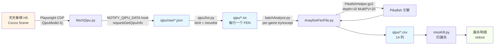
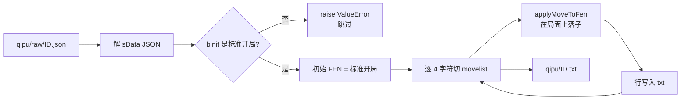
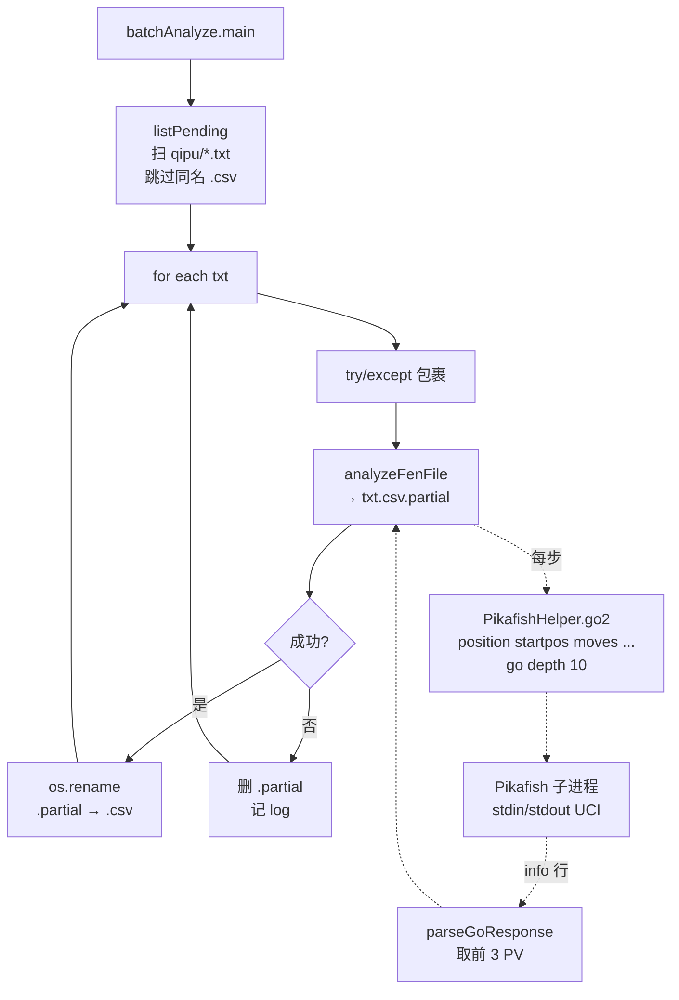
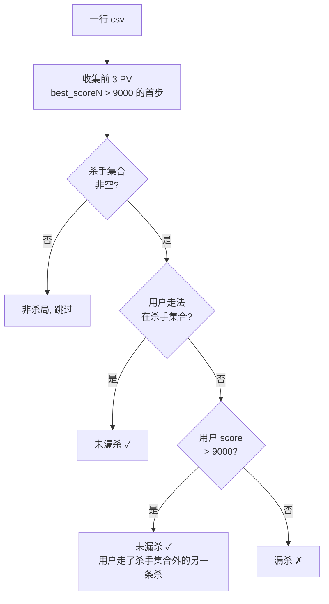

# 棋谱处理流水线

从"天天象棋 H5 拉最近棋谱"到"Pikafish 标注 → missKill 检测漏杀"的端到端管道。本文档梳理当前代码实际是怎么跑的,不是设想。

## 0. 全景图



**3 个落盘层**(蓝色节点)都是增量的:每一步都有"本地已有就跳过"的幂等逻辑,任何阶段中断都可以无损重跑。

---

## 1. 阶段一:拉棋谱 — `fetchQipu.py`

目标:把天天象棋 H5 账号下**最近 N 局**的原始 JSON 下载到本地,`qipu/raw/<qipuId>.json`。

### 运行方式

```bash
python3 src/fetchQipu.py
```

脚本以**持久化有头 Chromium**(Playwright `launch_persistent_context`) 打开,用户数据存在 `src/chrome_data/`。首次需要手动微信扫码登录,后续直接复用 cookie。

### 流程

```mermaid
flowchart TD
    S[启动 fetchQipu.py] --> L{profile 有效?}
    L -->|是| E[进入象棋大厅]
    L -->|否| W[点"协议"勾选框<br/>→ 微信登录<br/>→ 等扫码] --> E
    E --> P[page=1, prevIds=[]]
    P --> Q[QipuModel.Wfb=[]<br/>→ Xj 13, page, 20, 0<br/>→ 轮询 Wfb.length]
    Q --> C{本页 == 上页?}
    C -->|是| DONE[idlist 结束]
    C -->|否| A[累积到 allIds<br/>page++]
    A --> Q
    DONE --> M[过滤出<br/>qipu/raw/*.json 不存在的 ID]
    M --> D[逐个 hook<br/>NOTIFY_QIPU_DATA]
    D --> R[requestGetQipuInfo qipuId<br/>→ 轮询 __qipuResults id<br/>10s 超时]
    R --> S2[写 qipu/raw/qipuId.json]
```

### 两个核心 trick

**1) idlist 是"滑窗"不是分页**

天天象棋的 `QipuModel.Xj(iDataType=13, page, 20, 0)` 不是常规分页:

| page | 返回 ID 范围 |
|---|---|
| 1 | `id[0..19]` |
| 2 | `id[1..20]` |
| 3 | `id[2..21]` |

每页偏移 1。脚本用"本页 tuple 与上页相同"作为终止条件(`fetchQipu.py:L368`),而不是"空页"。

**2) `Xj` 是同步函数,不发事件**

最初以为 `Xj` 会触发 `NOTIFY_QIPU_MY_LIST_UPDATE_INFO`,实际它是**同步填充** `QipuModel.Wfb` 数组就返回。策略改为:

```
调用前 Wfb.length = 0
调用 Xj(...)
轮询 Wfb.length > 0 直到有数据
```

**3) 单局详情要 hook**

`QipuModel.requestGetQipuInfo(qipuId)` 不返回值,结果通过 `fdk.Joa.ba('NOTIFY_QIPU_DATA', cb)` 事件派发。脚本在调用前注入 hook,把结果塞到 `window.__qipuResults[id]`,然后 Python 端轮询(10s 超时)。

### 产物

```
qipu/raw/73753676038.json   # 每个文件 7-8 KB
qipu/raw/73756200504.json
...
```

原始 JSON 结构(简化):

```json
{
  "iQipuId": 73753676038,
  "sData": "{...JSON 字符串...}",   ← 真正的数据
  "playersInfo": [
    { "stTUserID": { "uUin": 577623960 }, ... },   ← 我方 UIN
    { ... }
  ]
}
```

`sData` 反序列化后里面有 `moveinfo.binit`(起始局面串)和 `moveinfo.movelist`(压缩走法串,每步 4 字符 `fx fy tx ty`)。

---

## 2. 阶段二:JSON → FEN 序列 — `qipu2txt.py`

目标:把 `qipu/raw/*.json` 转成 `qipu/*.txt`,每行一个 FEN(走第 i 步**之前**的局面)。

### 运行方式

```bash
cd src && python3 qipu2txt.py
```

### 流程



### 兼容两种格式

- **新格式**:`sData.moveinfo.binit / movelist`(来自 H5 API,2026 年开始)
- **老格式**:`{startFen, moves: [[fx,fy,tx,ty], ...]}`(`qipu/raw_legacy/`,老的手工整理 JSON)

`normalizeQipuJson()` 统一归一,下游逻辑不管来源。

### 关键硬约束

- `STANDARD_BINIT` / `STANDARD_START_FEN` 写死(`qipu2txt.py:L31-33`)。非标开局(如让子局)会 **raise**,直接跳过。
- 生成的 txt **不含末局 FEN 走子方**(Pikafish UCI 靠 `position startpos moves ...` 重建,不看 FEN)。

### 产物

```
qipu/73753676038.txt    # 72 行(每行一个 FEN,71 步)
qipu/73756200504.txt
...
```

---

## 3. 阶段三:Pikafish 分析 — `AnaylizeFenFile.py` + `batchAnalyze.py`

目标:对每局 txt,用 Pikafish 引擎逐步分析,产出 14 列 CSV。

### 运行方式

```bash
# 后台批量跑(推荐)
cd src && nohup python3 -u batchAnalyze.py > /tmp/batchAnalyze.out 2>&1 &

# 或单局
cd src && python3 -c "from AnaylizeFenFile import analyzeFenFile; analyzeFenFile('../qipu/X.txt', '../qipu/X.csv')"
```

### 架构



### `AnaylizeFenFile` 每步做什么

对第 `i` 步(txt 第 `i` 行 → 第 `i+1` 行):

1. `getMove(fen_i, fen_{i+1})` 还原用户的 UCI 走法
2. `pikafishHelper.go2(moves_so_far)` — 把从开局到"用户即将走这一步之前"的所有走法拼 UCI 发给 Pikafish,`go depth 10 MultiPV=20`
3. `parseGoResponse` 取前 3 PV
4. 找用户这一步在 top20 里的排名 `myRank`(不在就 `None`)
5. 组一行 14 列写入

### 批量层做的 3 件事

1. **断点续跑** — 靠"同名 csv 存在就跳过"(`batchAnalyze.py:L22`)
2. **原子写** — 先写 `X.csv.partial`,成功再 `os.rename` 成 `X.csv`,中途崩溃不会留脏数据
3. **单局隔离** — `try/except` 捕获任何异常(目前已知 `parseGoResponse` 偶发 `IndexError`),记 log,继续下一局

### 已知 bug(未修)

| 位置 | 表现 | 影响 |
|---|---|---|
| `pikafishHelper.py:L49` | `info` 行 token 不足 9 个时 `[8]` IndexError | 该局失败,batchAnalyze 跳过 |
| `Pikafish` 实例没有 teardown | 每局泄漏一个 Pikafish 子进程(~40MB) | 跑完 150 局后累积 ~6GB,零 CPU 但占 RAM |

### 硬编码(macOS)

```python
# src/pikafishHelper.py:L13
self.pikafish = Pikafish('/Users/u03013112/Documents/git/Pikafish/src/pikafish')
```

别的机器要改这里。Linux 走 docker/nsenter 路径(见 AGENTS.md)。

### 产物:14 列 CSV

| 列名 | 类型 | 含义 |
|---|---|---|
| `idx` | int | 1-based 回合号。**奇=红方**,偶=黑方 |
| `fen` | str | 走这一步**之前**的局面 FEN |
| `move_fen` | str | 用户实际走法(UCI,如 `h2e2`) |
| `move_qp` | str | 用户走法中文(如 `红 炮二平五`)。近似,兵/卒不准 |
| `score` | float/NaN | 用户这一步的 Pikafish 评分。**NaN = 不在 top20**(很差或极少见) |
| `best_move1_fen` | str | PV1 整条路径(UCI,逗号分隔),首步是 Pikafish 推荐第 1 招 |
| `best_move1_qp` | str | PV1 整条中文 |
| `best_score1` | int | PV1 评分 |
| `best_move2_fen` | str | PV2(同格式) |
| `best_move2_qp` | str | PV2 中文 |
| `best_score2` | int | PV2 评分 |
| `best_move3_fen` | str | PV3 |
| `best_move3_qp` | str | PV3 中文 |
| `best_score3` | int | PV3 评分 |

### Mate 编码(关键!)

Pikafish 的 `mate N` 指令表示"N 步之内绝杀"。脚本把它编码成整数分数:

| UCI | 编码分数 | 含义 |
|---|---|---|
| `mate 1` | **9900** | 1 步绝杀 |
| `mate 2` | **9800** | 2 步绝杀 |
| `mate N`(赢) | `10000 - N*100` | N 步绝杀 |
| `mate -1` | **−9900** | 自己下一步被绝杀 |
| `mate -N`(输) | `−10000 − N*100` | 被延长 N 步后必败 |

**阈值 9000** 是这套编码的"10 步杀"分界线:`10000 - 10*100 = 9000`。所有 `missKill.py` / `lookKill.py` 判杀规则都依赖这个阈值。

---

## 4. 阶段四:看杀检测 — `missKill.py`

目标:扫 `qipu/*.csv`,找出"本有绝杀但用户没走"的局面。

### 运行方式

```bash
python3 src/missKill.py
```

### 判定规则



**三条 OR 条件任一满足 → 不算漏**:

1. 用户走法 ∈ 前 3 PV 首步集合(`killMoveSet`)
2. 用户走法不在集合里,**但 `score > 9000`**(top20 里还有其他杀招,用户命中了)
3. (等价于 1 的情况)

只有用户既没走 top3 里的杀、自己那步的分数也没过 9000(弱招/极差招),才算真·漏杀。

### 和老版 `lookKill.py` 的差异

| 维度 | `lookKill.py` | `missKill.py` |
|---|---|---|
| 判杀 | 只看 `best_score1 > 9000` | 看 `best_score{1,2,3}` 任一 > 9000 |
| 关心的问题 | "这一步有杀招吗"(看杀) | "我有没有错过杀"(漏杀训练) |
| 用途 | 生成只读幻灯片 | 生成错题列表 |

### 产物(stdout)

```
[scan] 20240427230906fen.csv: 杀局 22 / 漏杀 4
================================================
共扫 N 个文件 | 总杀局 X 个 | 总漏杀 Y 个
漏杀率 Z%

漏杀明细:
  20240427230906fen.csv  idx= 37  红  你走=b8c6(None)  杀手集合=a9a8,c9c8,h0h8
    fen: C1R2ab2/1N2k4/5an2/...
```

这份输出是未来 `missKillUI.py` 的题库来源。

---

## 5. 数据落盘一览

跑完全链路后,`qipu/` 目录是这样的:

```
qipu/
├── raw/                       # 原始 JSON(fetchQipu 写)
│   ├── 73753676038.json
│   └── ...                    # 151 个文件
├── raw_legacy/                # 老的手工整理 JSON
├── 73753676038.txt            # FEN 序列(qipu2txt 写)
├── 73753676038.csv            # 引擎标注(AnaylizeFenFile 写)
├── ...
├── batchAnalyze.log           # 批量分析日志
└── batchAnalyze.csv.partial   # 进行中的临时文件(存在即未完成)
```

每阶段都有幂等性——同名产物存在就跳过,放心随时 `^C` 重跑。

---

## 6. 规模与时长(经验值)

| 环节 | 单位成本 | 150 局估算 |
|---|---|---|
| fetchQipu | 1-2 秒/局(含 10s 超时兜底) | 3-5 分钟 |
| qipu2txt | 毫秒级 | 秒级 |
| AnaylizeFenFile | 每步 ≈5s(depth=10 timeout),单局 3-60 分钟(方差极大) | 10-70 小时 |
| missKill | 毫秒级 | 秒级 |

瓶颈在阶段三。如果时间受限,可以调 `pikafishHelper.py`:

- `depth=6`:约 3x 快,杀局检测精度基本不受影响(mate 搜索深度不受此参数限制)
- `MultiPV=5`:约 4x 快,`missKill` 只看 top3 所以也不受影响

---

## 7. FEN / UCI 惯例(踩坑提醒)

本 repo 里有一个广泛遗留的颜色倒置 bug(README 和 `ChessBoard.py:L67` 有记录)。**新写代码时一律按 UCI 原生约定**:

- **Uppercase = Red**(先手,底部),lowercase = Black
- FEN rows 从**顶到底**列出(黑方在前)
- 坐标:files `a-i`,ranks `0-9`(红方底线 `0`,黑方底线 `9`)
- 走法:UCI 4 字符,`h2e2` = 红炮二平五(红方开局惯用)

`missKill.py` 里已经按正确惯例:`idx % 2 == 1` 判红(因为红先手 = idx=1,3,5...)。

---

## 8. 下一步可能的扩展

1. **`missKillUI.py`**:tkinter 交互训练 UI,拿 `missKill.py` 的漏杀局当题库,用户重做,错题本 JSON 持久化
2. **我方识别**:新棋谱的 `qipu/raw/<id>.json` 里有 `playersInfo[*].stTUserID.uUin`,可以精确判断"这一步到底是不是我方走的",过滤对手的漏杀
3. **修 `parseGoResponse:L49`**:加 `if len(tokens) < 9: continue`,消除 `IndexError` 失败局
4. **加 Pikafish teardown**:`PikafishHelper.__del__` 发 `quit` 并 `process.wait`,消除子进程泄漏
